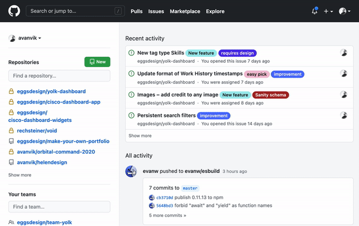
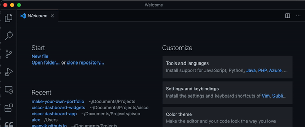

# Make your own portfolio

With HTML, CSS and Javascript! In this course we are going to code a portfolio, and host it with [GitHub Pages](https://pages.github.com/). This will give you an introduction to web technology and Git, which should be a solid foundation to build your continued code mastery upon.

## Day 1: Setting things up

- Install Git, VSCode and sign up to GitHub
- Create a repository
- Create an HTML file
- Publish to GitHub Pages

### 1. Install Git, VSCode and sign up to GitHub

You can follow [these steps](./setup.md)

### 2. Create a repository on GitHub

<details>
	<summary>Show me</summary>



</details>

To make hosting simpler, follow these steps closely

1. Make sure you are logged in to GitHub. Click the GitHub logo to navigate to the front page.
2. Click on the `New` button to create a new repository.
3. Name it `<username>.github.io`. In my case, the repo is called `avanvik.github.io` This will make hosting with GitHub Pages work almost like magic ✨
4. Click `Create repository`
5. **Important** Click `HTTPS`and copy the generated repo link (mine looks like this`https://github.com/avanvik/avanvik.github.io.git`
6. In VSCode, click `clone repository...` and paste in the GitHub repo url. Pick where you want to put the project. I usually put mine in `Documents/Projects/`. **Note:** VSCode will try to authenticate your GitHub user, so just follow the required steps for that.

<details>
	<summary>Show me</summary>



</details>

### 3. Create a 'main' branch

A git branch is like a folder where your code changes go. GitHub Pages require a `main` branch, but VSCode – for some dumb reason – starts with a `master` branch. Solve this by creating a new branch in VSCode.

1. In the VSCode toolbar (the bar stuck to the top of your screen on Mac) click `Terminal > New Terminal`. This will open a new panel with a terminal in it, navigated to your project folder.
2. Type `git checkout -b main` and click Enter to run the command. This will create a new branch called `main` and set it as the active branch.

### 4. Create an HTML file

1. In VSCode, create a new file in your project folder.
2. Name it `index.html` and open the file.

### 5. Commit your changes

<details>
	<summary>Show me</summary>


</details>

1. In VSCode click the "Source Control" tab in the left sidebar. It should have a notification icon, since you added your index.html file.
2. Click the "✔" Icon to commit all changes
3. Click the arrow icon to push your changes to GitHub (Lower left corner of the editor window).

**Note:** For some people this might trigger an error message, saying that github username and email are not properly configured.

To fix this, run the following commands – one by one – in your terminal in VSCode. Replace the parameters in "" to fit your own name and e-mail, and click Enter to run the command.

```
git config --global user.name "Your Name"
git config --global user.email "youremail@yourdomain.com"
```

<details>
	<summary>Show me</summary>


</details>

## Day 2: Building your portfolio page

- Add content and structure with HTML
- Add style with CSS

More to come
