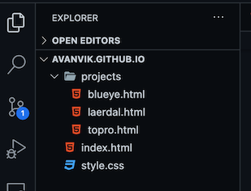

# Day 2: Adding content and styling

By now, you should have done the following:

- Create an HTML page with some content
- Connect a CSS file and add some basic styles like background color
- Connect your local website folder with a repository on GitHub, so you can easily commit code and have it update on the website on the internet for the world to see.

If you were nodding profusely to the previous steps; great, let's proceed! If not, have a look at the guide for [Day 1: Putting a page up on the internet](./day-1.md) and come back when you are ready.

## 1. Add cool projects

Add the following content to your index.html page, somewhere under the content you created in the Day 1 session. Note that you will need to add a folder called "assets" and put your images there. Or, you can link to images on the internet.

```html

<h2>Blueye Robotics FPV App</h2>


<h2>Laerdal Scenario Cloud</h2>


<h2>Topro Augmented Rollator</h2>
```

## 2. Wrap each project with anchor tags `<a>`

This will turn the content into clickable links that leads the browser to a new location. Do this for each project you have listed. Each `<a>` tag should have a `href` property pointing to an html page. **For now you can leave it empty**.

```html
<a href="">
  
  <h2>Blueye Robotics FPV App</h2>
</a>
```

## 3. Create html files for each project case

Make a new html page for each project. In my case it ends up looking like this:



## 4. Add content to each project html file

```html


<a href="../index.html">👈 Go back</a>

<h2>That project with the subsea robot</h2>
<p>
  Blueye aims to make underwater exploration possible for everyone with user-friendly and supreme underwater drones that
  let you discover and learn about the world hidden below the surface. The PioneerOne drone was designed and realized in
  3 months as a prototype to exemplify Blueyes capabilities and vision.
</p>
```
